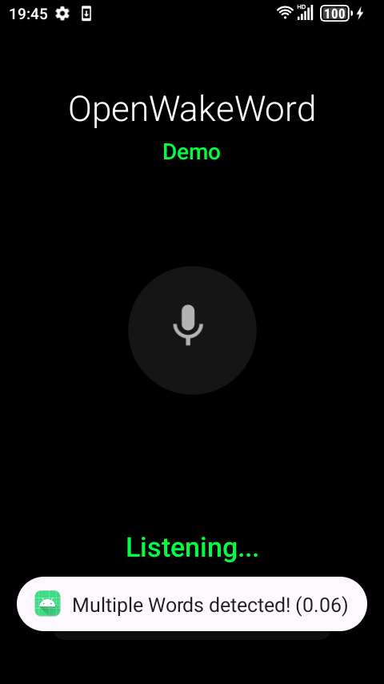
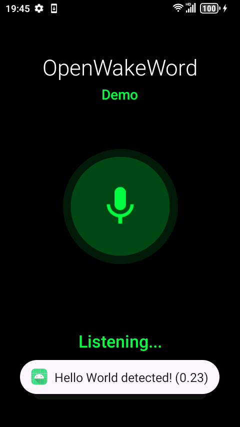

# OpenWakeWord Android Kotlin Library

Kotlin library for on-device wake word detection on Android using ONNX Runtime.

## Features

🔊 **Multi-Wake-Word** - Register unlimited ONNX classifier models at runtime  
🧩 **Straightforward API** - Simple Flow-based API with minimal boilerplate  
🚀 **Kotlin Coroutines** - Background audio + inference without blocking UI

## Requirements

- Android SDK 23+ (Android 6.0 Marshmallow)
- RECORD_AUDIO permission

## Installation

```bash
./gradlew :wakeword:publishToMavenLocal
```

```kotlin
dependencies {
    implementation("xyz.rementia:openwakeword:0.1.3")
}
```

Import the engines:
```kotlin
import com.rementia.openwakeword.lib.WakeWordEngine
import com.rementia.openwakeword.lib.ParallelWakeWordEngine
```

## Usage

### Basic Example

```kotlin
// 1. Define wake word models
val models = listOf(
    WakeWordModel("Hello World", "hello_world.onnx", threshold = 0.5f),
    WakeWordModel("Hey Assistant", "hey_assistant.onnx", threshold = 0.08f)
)

// 2. Create engine (choose based on your needs)
// Option A: Standard engine - good for 1-2 models
val engine = WakeWordEngine(
    context = context,
    models = models,
    detectionMode = DetectionMode.SINGLE_BEST
)

// Option B: Parallel engine - optimal for 3+ models or low-latency requirements
val parallelEngine = ParallelWakeWordEngine(
    context = context,
    models = models,
    detectionMode = DetectionMode.ALL,
    maxWorkers = 8  // Adjust based on device capabilities
)

// 3. Start detection
engine.start()

// 4. Collect detections
lifecycleScope.launch {
    engine.detections.collect { detection ->
        Log.d("WakeWord", "${detection.model.name} detected!")
    }
}

// 5. Cleanup
override fun onDestroy() {
    super.onDestroy()
    engine.release()
}
```

### Multiple Models Example

```kotlin
// Configure multiple wake words with different thresholds
val models = listOf(
    WakeWordModel("Computer", "computer.onnx", 0.1f),
    WakeWordModel("Assistant", "assistant.onnx", 0.08f),
    WakeWordModel("Robot", "robot.onnx", 0.15f),
    WakeWordModel("Jarvis", "jarvis.onnx", 0.12f),
    WakeWordModel("Alexa", "alexa.onnx", 0.09f)
)

// For 3+ models, use ParallelWakeWordEngine for optimal performance
val parallelEngine = ParallelWakeWordEngine(
    context = context,
    models = models,
    detectionMode = DetectionMode.ALL,
    maxWorkers = models.size * 2  // Allow parallel processing
)

// Handle detections with proper SharedFlow collection
lifecycleScope.launch {
    parallelEngine.detections
        .onEach { detection ->
            Log.d("WakeWord", "${detection.model.name}: ${detection.score}")
        }
        .catch { e ->
            Log.e("WakeWord", "Error collecting detections", e)
        }
        .collect()
}
```

### Performance Optimization

```kotlin
// For memory-constrained devices
<application
    android:largeHeap="true"
    ...>

// Optimize for many models
val engine = ParallelWakeWordEngine(
    context = context,
    models = models,
    maxWorkers = 12,  // Increase for more parallelism
    detectionCooldownMs = 1000L  // Reduce for faster re-detection
)
```

### Required Files

Place ONNX models in your app's `assets` directory:
```
app/src/main/assets/
├── your_wake_word.onnx
├── melspectrogram.onnx
└── embedding_model.onnx
```

## API Reference

### Choosing the Right Engine

| Engine | Best For | Characteristics |
|--------|----------|----------------|
| **WakeWordEngine** | • 1-2 models<br>• Simple use cases<br>• Lower memory devices | • Sequential processing<br>• Lower CPU usage<br>• Stable latency |
| **ParallelWakeWordEngine** | • 3+ models<br>• Low-latency requirements<br>• High-performance devices | • Parallel processing<br>• Non-blocking architecture<br>• Optimal multi-model performance |

### WakeWordEngine

The standard wake word detection engine with sequential processing.

```kotlin
class WakeWordEngine(
    context: Context,
    models: List<WakeWordModel>,
    detectionMode: DetectionMode = DetectionMode.SINGLE_BEST,
    detectionCooldownMs: Long = 2000L,
    scope: CoroutineScope = CoroutineScope(Dispatchers.Default)
)
```

### ParallelWakeWordEngine

High-performance engine with fully parallel, non-blocking processing.

```kotlin
class ParallelWakeWordEngine(
    context: Context,
    models: List<WakeWordModel>,
    detectionMode: DetectionMode = DetectionMode.SINGLE_BEST,
    detectionCooldownMs: Long = 2000L,
    maxWorkers: Int = 8,  // Maximum concurrent workers
    scope: CoroutineScope = CoroutineScope(Dispatchers.Default + SupervisorJob())
)
```

**Key Features:**
- **Non-blocking**: Audio processing never blocks inference
- **True parallelism**: Each model runs independently
- **Worker pool**: Prevents resource exhaustion with `maxWorkers`
- **Ring buffer**: Efficient audio data management
- **Fine-grained sliding**: 50ms windows for better temporal resolution

**Properties:**
- `detections: Flow<WakeWordDetection>` - Flow of detection events

**Methods:**
- `start()` - Start wake word detection
- `stop()` - Stop wake word detection  
- `release()` - Release all resources

### WakeWordModel

Configuration for a wake word model.

```kotlin
data class WakeWordModel(
    val name: String,
    val modelPath: String,
    val threshold: Float = 0.5f
)
```

### WakeWordDetection

Detection event data.

```kotlin
data class WakeWordDetection(
    val model: WakeWordModel,
    val score: Float,
    val timestamp: Long = System.currentTimeMillis()
)
```

## Building from Source

```bash
# Clone the repository
git clone https://github.com/rementia/openwakeword-android-kt.git
cd openwakeword-android-kt

# Build the project
./gradlew build

# Run tests
./gradlew test

# Build and install sample app
./gradlew :app:installDebug
```

## Sample App

<p align="center">
  
  
</p>

## License

This project is licensed under the Apache License 2.0 - see the [LICENSE](LICENSE) file for details.

```
Copyright 2025 Re-mentia

Licensed under the Apache License, Version 2.0 (the "License");
you may not use this file except in compliance with the License.
You may obtain a copy of the License at

    http://www.apache.org/licenses/LICENSE-2.0

Unless required by applicable law or agreed to in writing, software
distributed under the License is distributed on an "AS IS" BASIS,
WITHOUT WARRANTIES OR CONDITIONS OF ANY KIND, either express or implied.
See the License for the specific language governing permissions and
limitations under the License.
```

This project includes code derived from [OpenWakeWord for Android](https://github.com/hasanatlodhi/OpenwakewordforAndroid) by hasanatlodhi, also licensed under Apache License 2.0.

## Acknowledgments

This library is based on and inspired by [OpenWakeWord for Android](https://github.com/hasanatlodhi/OpenwakewordforAndroid) by hasanatlodhi, licensed under Apache License 2.0. We've ported the Java implementation to Kotlin and restructured it as a reusable library with a modern Flow-based API.

### Model Attribution

This project uses models from the [OpenWakeWord](https://github.com/dscripka/openWakeWord) project by David Scripka:
- `melspectrogram.onnx` - Audio preprocessing model (Apache 2.0 License)
- `embedding_model.onnx` - Speech embedding model (Apache 2.0 License, originally from Google)

The embedding model is based on Google's speech embedding model released under Apache 2.0 License.

### Training Custom Wake Words

To train your own wake word models:
1. Use the official OpenWakeWord training repository: [openWakeWord](https://github.com/dscripka/openWakeWord)
2. Follow the training notebook: [Google Colab Training Guide](https://colab.research.google.com/drive/1q1oe2zOyZp7UsB3jJiQ1IFn8z5YfjwEb?usp=sharing)
3. Export your trained model as ONNX format
4. Place the `.onnx` file in your app's `assets` directory

## Contributing

Contributions are welcome! Please feel free to submit a Pull Request.
